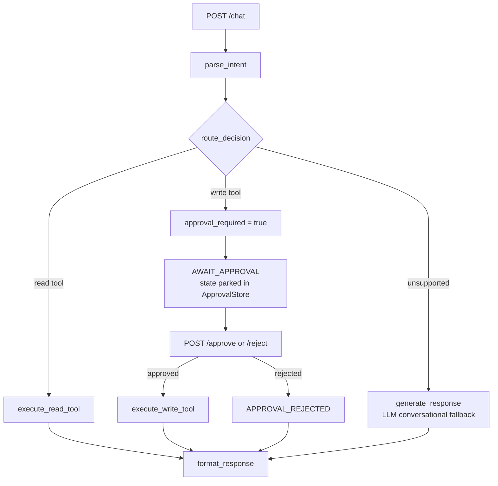

# Demo Reference — Mini Agentic ERP Assistant

A tool-calling agent over a mock ERP. Typed state machine + FastAPI + Next.js chat UI, with a human approval gate on writes.

---

## 1. Structure

```
app/
  api/          FastAPI layer — routes, request/response schemas, DI singletons
  runtime.py    The agent state machine (parse → route → execute → format)
  state.py      AgentState + NextAction enum; validators enforce invariants
  errors.py     ErrorCode taxonomy; Retryable vs NonRetryable tool errors
  tools/        schemas (pydantic) · erp_tools (impls) · registry · specs (LLM fn-calling)
  providers/    erp (data) · openai_provider (LLM) · intent_classifier · config
  approvals/    In-memory store for states paused awaiting approval
data/           projects.json, risks.json — the mock ERP
frontend/       Next.js chat UI (app/page.tsx, lib/api.ts SSE client)
tests/          pytest; conftest pins deterministic classifier + fresh state
```

**3 tools:** `get_project_status`, `list_risks` (reads) · `create_risk` (write, approval-gated).

---

## 2. Workflow



**Key idea:** `/chat` never executes a write. It halts at `AWAIT_APPROVAL`, stores the state under an `approval_id`, and returns it. A separate `/approve` call resumes that exact state. The store `pop`s, so an id resolves **once**.

### Endpoints
| Route | Purpose |
|---|---|
| `POST /chat` · `/chat/stream` | Send a message (`/stream` = SSE: `status` → `token` → `done`) |
| `POST /approve` · `/reject` (+ `/stream`) | Resolve a pending write |
| `GET /health` | Liveness |

---

## 3. Design patterns

| Pattern | Where | Why |
|---|---|---|
| **State machine** | `runtime.py` + `NextAction` | Each step is a pure `AgentState → AgentState` fn. Testable, traceable, pausable mid-flow. |
| **Immutable transitions** | `_evolve()` | Rebuilds via constructor so validators re-run on *every* transition — not `model_copy`. |
| **Protocol (structural typing)** | `ToolRegistry`, `ERPProvider`, `LLMProvider`, `IntentClassifier` | Runtime depends on interfaces, not impls. Swap mock ERP → Odoo, or LLM → keyword classifier, with no runtime change. |
| **Factory / closure DI** | `make_create_risk(provider)` | Tools close over their provider; registry wires them at build time. |
| **Human-in-the-loop gate** | `WRITE_TOOLS` + `ApprovalStore` | Writes are structurally incapable of running unapproved. |
| **Graceful degradation** | `default_classify` fallback | No API key → deterministic keyword classifier. App stays demoable offline. |
| **Error taxonomy** | `Retryable` vs `NonRetryable` | Drives auto-retry (`MAX_RETRIES=2`) vs immediate fail. Tool errors become responses, never 500s. |

### Invariants enforced in `AgentState`
- A write's `tool_output` cannot exist without `approved=True`.
- `tool_output` and `error_code` are mutually exclusive.
- `approved` is meaningless unless `approval_required`.

---

## 4. The `create_risk` flow (best thing to demo)

Two schemas for one tool — the crux of the design:

- **`CreateRiskDraftInput`** → handed to the LLM. *Everything optional.*
- **`CreateRiskInput`** → gates execution. *Strict: title + severity required, blank titles rejected.*

**Why:** if the LLM sees a strict schema, a bare *"add a risk"* gives it nothing valid to call, so it declines → falls through to a chat reply asking *"what's the title? severity?"*. With the lenient schema it calls the tool immediately with whatever it has, and the **approval form appears right away** for the user to fill in. Strictness moves to execution time, where it belongs.

The backend returns a `risk_draft` pre-fill, so anything the user already said comes back filled in.

**Demo script:**
1. `What's the status of PRJ-001?` → read tool, instant answer
2. `add a risk` → form appears immediately (blank, ready to fill)
3. Fill title + severity → **Approve** → risk created
4. `Show risks for PRJ-001` → the new risk is there
5. Repeat step 2 but **Reject** → `APPROVAL_REJECTED`, nothing written
6. `What's the status of PRJ-999?` → clean `NOT_FOUND`, not a crash

---

## 5. Running it

```bash
# Backend
uv run uvicorn app.api.main:app --reload --port 8000   # :8000/docs for Swagger

# Frontend
cd frontend && npm install && npm run dev               # :3000

# Tests
uv run pytest -q
```

**Config** (`.env`): `LLM_PROVIDER` (`deterministic` | `openai`), `OPENAI_API_KEY`, `OPENAI_MODEL`, `OPENAI_BASE_URL` (any OpenAI-compatible endpoint).

---

## 6. Known limits — own these if asked

- **In-memory everything.** Approval store + created risks live in process memory → **single uvicorn worker only**; restart wipes state.
- Approvals never expire.
- Classifier quality is model-dependent; small models often skip `title`/`severity` extraction (harmless — the form collects them).
- 12 pre-existing test failures unrelated to the risk-form work: `make_tool_calling_classifier` returns `unsupported` on provider error where its tests expect a `default_classify` fallback, plus some `list_risks` seed-data drift.
