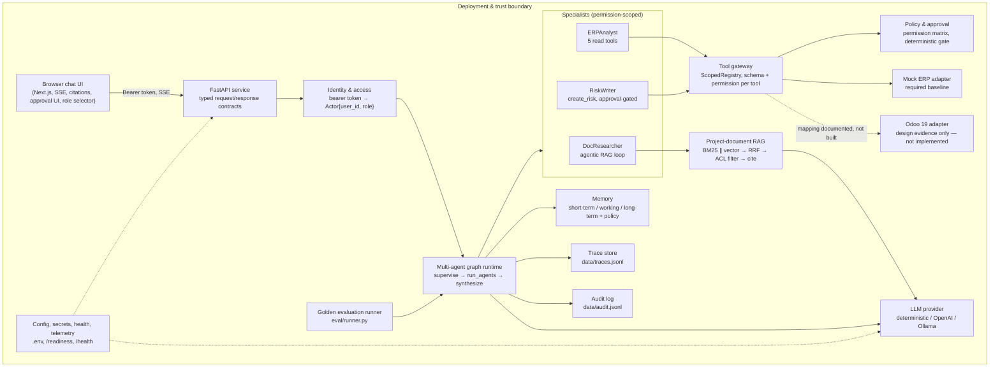

# Architecture

## Diagram

## Service boundaries

Dependency direction is inward: the browser depends on the API's typed
contracts; the API depends on the graph runtime; the runtime depends on
**ports** (`ERPProvider`, `LLMProvider`, `EmbeddingProvider`, `VectorIndex`),
never on concrete adapters. `MockERPProvider`, `OpenAIProvider`,
`OllamaProvider`, and `ChromaVectorIndex` all live behind their ports in
`app/providers/` and `app/rag/`, and are selected by `app/providers/config.py`
reading environment variables — swapping one for another is a config change,
not a runtime-code change. This is what makes the Odoo mapping (`docs/odoo-mapping.md`)
implementable later without touching `app/agents/` or `app/runtime.py`.

Concrete providers never leak into the agent runtime: no module under
`app/agents/`, `app/runtime.py`, or `app/graph/` imports `openai`, `chromadb`,
or any ERP-specific symbol directly — they only import the `Protocol` in
`app/providers/base.py` / `app/providers/erp.py` / `app/rag/vector_index.py`.

## Request path (typical grounded question)

1. `POST /chat` — `get_current_actor` resolves the bearer token to an `Actor{user_id, role}` (401 if missing/invalid).
2. `run_multi_agent()` builds a fresh `AgentState` and enters the multi-agent graph at `SUPERVISE`.
3. **Supervisor** (`app/agents/supervisor.py`) plans a typed `list[AgentStep]` — deterministic keyword/doc-vocabulary heuristic, or an LLM planning call when a provider is configured.
4. **RUN_AGENTS** dispatches each step to its specialist through a `ScopedRegistry` narrowed to that specialist's tool allowlist, checking the resolved permission (`app/security/permissions.py`) before the tool boundary is ever reached.
5. **DocResearcher** runs the agentic RAG loop (`app/rag/agentic.py`): plan query → retrieve (BM25 ∥ vector → RRF → ACL filter) → grade → refine (bounded) → generate → verify citations → refuse if ungrounded.
6. **SYNTHESIZE** merges specialist results, unions citations, and sets the top-level route/citations/error_code.
7. A write step (`create_risk`) instead halts the whole graph at `AWAIT_APPROVAL`; the pending state is stored in `ApprovalStore` and the API returns an `approval_id` plus a pre-filled risk-draft form.
8. Every node transition, retrieval, agent hop, and tool call is recorded to a `TraceRecorder` keyed by `request_id`; auth, tool calls, approval decisions, and blocked actions are written to the append-only audit log.
